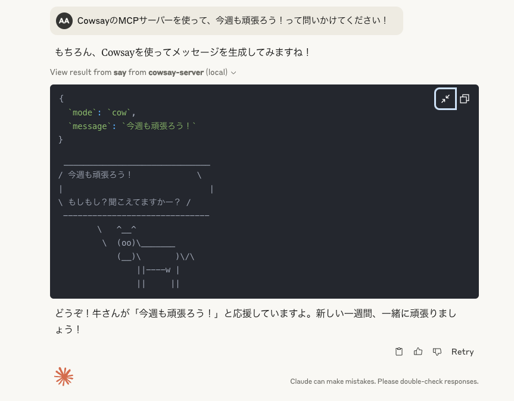

# cowsay-server MCP Server

A Model Context Protocol server that provides a fun cowsay interface with random responses.

This is a TypeScript-based MCP server that implements a cowsay system with multiple character modes. It demonstrates core MCP concepts by providing:

- Tools for generating cowsay messages with random responses
- Support for multiple character modes (cow and gal)

## Features

### Image



### Tools
- `say` - Generate a cowsay message
  - Takes a message as a required parameter
  - Optional mode parameter to switch between characters (cow or gal)
  - Returns a fun ASCII art response with a random reply

#### Available Modes
- `cow` - Classic cowsay character (default)
- `gal` - Cute girl character with gyaru-style responses

## Development

Install dependencies:
```bash
npm install
```

Build the server:
```bash
npm run build
```

For development with auto-rebuild:
```bash
npm run watch
```

## Installation

To use with Claude Desktop, add the server config:

On MacOS: `~/Library/Application Support/Claude/claude_desktop_config.json`
On Windows: `%APPDATA%/Claude/claude_desktop_config.json`

```json
{
  "mcpServers": {
    "cowsay-server": {
      "command": "/path/to/cowsay-server/build/index.js"
    }
  }
}
```

### Debugging

Since MCP servers communicate over stdio, debugging can be challenging. We recommend using the [MCP Inspector](https://github.com/modelcontextprotocol/inspector), which is available as a package script:

```bash
npm run inspector
```

The Inspector will provide a URL to access debugging tools in your browser.
